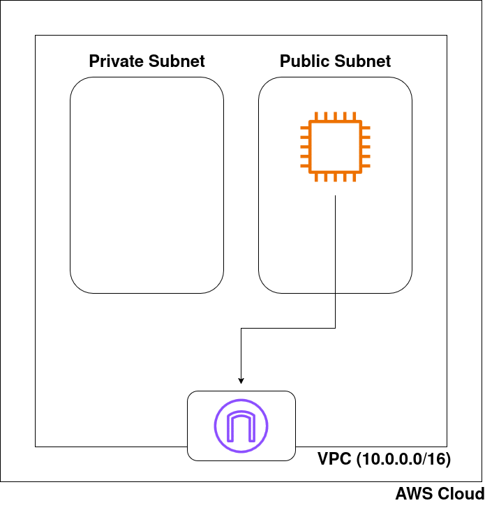
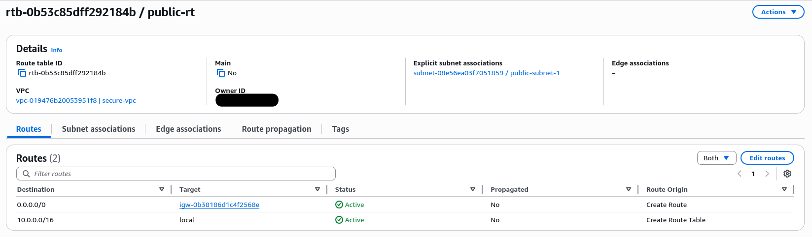
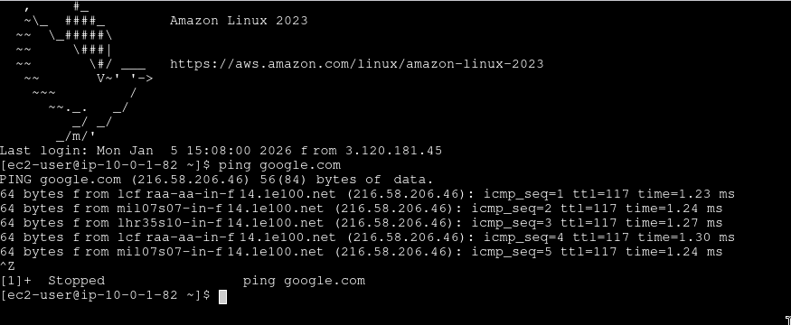

# AWS Secure VPC Implementation ☁️

## Project Overview
This project demonstrates the manual deployment ("ClickOps") of a secure Virtual Private Cloud (VPC) infrastructure in AWS. The goal was to design a network architecture with strict segmentation between public and private resources, implementing custom routing and security hardening.

## Architecture

## Key Features Implemented
* **Custom VPC:** Created a dedicated network `10.0.0.0/16` avoiding default settings.
* **Network Segmentation:**
    * `Public Subnet` (10.0.1.0/24) for Bastion Host/Web Servers.
    * `Private Subnet` (10.0.2.0/24) for internal workloads (simulated).
* **Traffic Control:**
    * Configured **Internet Gateway** for external connectivity.
    * Created **Custom Route Tables** to explicitly control traffic flow (avoiding the Main Route Table risk).
* **Security Hardening:**
    * Configured **Security Groups** to allow SSH/ICMP only from trusted sources.
    * Solved connectivity issues by diagnosing Outbound Rules configuration.

## Validation (Proof of Concepts)

### 1. Routing Configuration
*Explicitly routing 0.0.0.0/0 to the Internet Gateway:*

### 2. Connectivity Test
*Successful SSH connection and external ping to Google DNS:*

## Technologies Used
* AWS (VPC, EC2, IGW, Route Tables, Security Groups)
* Networking (CIDR, Subnetting, TCP/IP, ICMP)
* Linux (Amazon Linux 2023)
